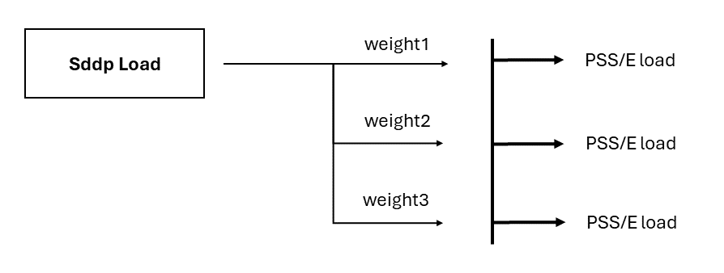

# Plant dispatch

This script distribute SDDP or NCP plant's generation in PSS/E generators.


## Requirements

- PSS/E 33 or newer
- Python 3.3 or newer
  - [psr-graf](https://github.com/psrenergy/pygraf)
    - `pip install psr-graf`
  - optional: pandas and numpy


## Usage

1. Run Sddp with appropriate result files enabled
    - Thermal generation (`gerter`)
    - Renewable generation (`gergnd`)
    - Hydro generation (`gerhid`)
    - Battery generation (`gerbat`)
    - CSP generation (`gercsp`)
    - Power injection output (`powinj`)
2. [Create a CSV file mapping Sddp scenarios to PSS/E scenarios (files)](#scenario-names)
3. [Create a CSV file mapping Sddp plants to PSS/e generators](#sddpncp-plant-to-psse-generator-mapping)
4. [Create a CSV file mapping Sddp demands to PSS/e loads](#sddpncp-load-to-psse-load-mapping)
5. Run [](sddp_plant_dispatch.py) script:

```bat
python sddp_plant_dispatch.py -p "path/to/psse/installation" -c "path/to/psse.sav" -sp "C:\temp\sddp_case"
```

For NCP, the steps are the same, except the output files are named as below:

- Thermal generation (`gertercp`)
- Renewable generation (`gergndcp`)
- Hydro generation (`gerhidcp`)
- Battery generation (`gerbatcp`)

The command for NCP dispatch is:

```bat
python sddp_plant_dispatch.py -m ncp -p "path/to/psse/installation" -c "path/to/psse.sav" -sp "C:\temp\sddp_case"
```


### Input files

The following input files are required to run the script:

| Input File                                                                    | Description                                    |
|:------------------------------------------------------------------------------|:-----------------------------------------------|
| [scenario_names.csv](#scenario-names)                                         | Maps SDDP or NCP scenarios to PSS/E file names |
| [sddp_plant_psse_generator_map.csv](#sddpncp-plant-to-psse-generator-mapping) | Maps SDDP or NCP plants to PSS/E generators    |
| [sddp_plant_psse_generator_map.csv](#sddpncp-load-to-psse-load-mapping)       | Maps SDDP or NCP demands to PSS/E loads        |


#### Scenario names

Maps a Sddp scenario to a PSS/E file name.

|     Column      | Description                      |
|:---------------:|:---------------------------------|
|  Stage Number   | SDDP or NCP stage number         |
| Scenario Number | SDDP or NCP scenario number      |
|  Block Number   | SDDP or NCP block or hour number |
|  Scenario Name  | PSS/E file scenario name         |


#### SDDP/NCP Plant to PSS/E generator mapping

It's possible to distribute SDDP or NCP Plants' generation in multiple PSS/E generators using weights. The figure below illustrates it.


The file name is `sddp_plant_psse_generator_map.csv` and its column names are:

|    Column     | Description                                                   |
|:-------------:|:--------------------------------------------------------------|
|   System ID   | String with SDDP or NCP system id                             |
|  Plant Type   | String with SDDP or NCP plant type                            |
|  Plant Name   | String with SDDP or NCP plant name                            |
|   Plant Bus   | SDDP or NCP plant's bus number                                |
|    Weight     | Distribution weight of plant power to PSS/E generator element |
| Generator Bus | PSS/E generator's bus number                                  |
| Generator Id  | PSS/E generator's ID. It can be enclosed with `'`             |


Supported plant types:

|   Plant Type   | Description                    | SDDP | NCP |
|:--------------:|:-------------------------------|:----:|:---:|
|   hidroplant   | Hydro plant                    | ✅   | ✅  |
|  thermalplant  | Thermal plant                  | ✅   | ✅  |
| renewableplant | Renewable plant                | ✅   | ✅  |
|    battery     | Battery                        | ✅   | ✅  |
|      csp       | Concentrated solar power plant | ✅   | ❌  |
| powerinjection | Power injection                | ✅   | ❌  |

The weight value is used to distribute SDDP or NCP plant's dispatch to multiple PSS/E generators. 
For a specific generator `i` associated with a plant `j`, the PSS/e generator dispatch is like:

```
PSS/E generator's Pg(i) = weight(j, i) * SDDP/NCP Plant (j) dispatch
```

It shows that all weight for a plant can have a sum bigger than 1.0, 
and consequently PSS/E is going to see a dispatch bigger than SDDP/NCP.

#### SDDP/NCP Load to PSS/E load mapping

It's possible to distribute SDDP/NCP Loads' load in multiple PSS/E loads using weights. The figure below illustrates it.



The file name is `sddp_psse_load_map.csv` and its column names are:

|      Column       | Description                                                   |
|:-----------------:|:--------------------------------------------------------------|
| SDDP/NCP Bus Name | String with SDDP/NCP bus name                                 |
|      Weight       | Distribution weight of plant power to PSS/E generator element |
|     Load Bus      | PSS/E load's bus number                                       |
|      Load Id      | PSS/E load's ID. It can be enclosed with `'`                  |

The weight value is used to distribute SDDP/NCP bus load's to multiple PSS/E loads. 
For a specific PSS/E load `i` associated with a SDDP/NCP bus load `j`, the PSS/e load value is like:

```
PSS/E load's Pl(i) = weight(j, i) * SDDP/NCP Bus Load (j) value
```
