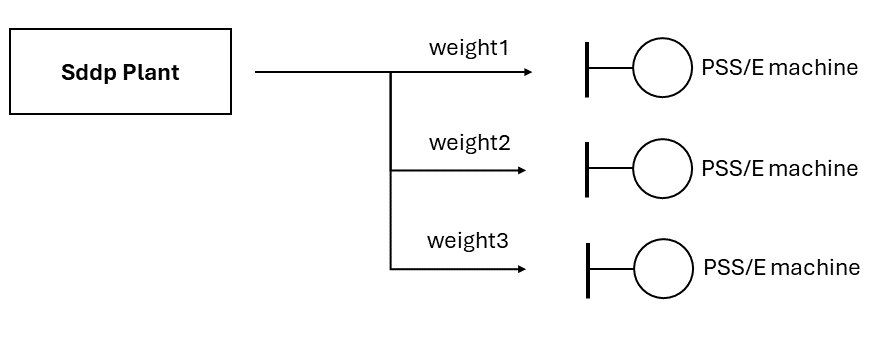

# Plant dispatch

This script distribute Sddp plant's generation in PSS/E generators.


## Requirements

- PSS/E 33 or newer
- Python 3.3 or newer
  - [psr-graf](https://github.com/psrenergy/pygraf)
    - `pip install psr-graf`
  - optional: pandas and numpy


## Usage

1. Run Sddp with appropriate result files enabled
    - Thermal generation
    - Renewable generation
    - Hydro generation
    - Battery generation
    - CSP generation
    - Power injection output
2. [Create a CSV file mapping Sddp scenarios to PSS/E scenarios (files)](#scenario-names)
3. [Create a CSV file mapping Sddp plants to PSS/e generators](#sddp-plant-to-psse-generator-mapping)
4. Run [](sddp_plant_dispatch.py) script:

```bat
python sddp_plant_dispatch.py -p "path/to/psse/installation" -c "path/to/psse.sav" -sp "C:\temp\sddp_case"
```


### Input files

The following input files are required to run the script:

| Input File                                                                 | Description                             |
|:---------------------------------------------------------------------------|:----------------------------------------|
| [scenario_names.csv](#scenario-names)                                      | Maps Sddp scenarios to PSS/E file names |
| [sddp_plant_psse_generator_map.csv](#sddp-plant-to-psse-generator-mapping) | Maps Sddp plants to PSS/E generators    |


#### Scenario names

Maps a Sddp scenario to a PSS/E file name name.

|     Column      | Description                |
|:---------------:|:---------------------------|
|  Stage Number   | Sddp stage number          |
| Scenario Number | Sddp scenario number       |
|  Block Number   | Sddp block or hour number  |
|  Scenario Name  | PSS/E file scenario name   |


#### Sddp Plant to PSS/E generator mapping

It's possible to distribute Sddp Plants' generation in multiple PSS/E generators using weights. The figure below illustrates it.




The file name is `sddp_plant_psse_generator_map.csv` and its column names are:

|    Column     | Description                                                   |
|:-------------:|:--------------------------------------------------------------|
|   System ID   | String with Sddp system id                                    |
|  Plant Type   | String with Sddp plant type                                   |
|  Plant Name   | String with Sddp plant name                                   |
|    Weight     | Distribution weight of plant power to PSS/E generator element |
| Generator Bus | PSS/E generator's bus number                                  |
| Generator Id  | PSS/E generator's ID. It can be enclosed with `'`             |


Supported plant types:

|   Plant Type   | Description                    |
|:--------------:|:-------------------------------|
|   hidroplant   | Hydro plant                    |
|  thermalplant  | Thermal plant                  |
| renewableplant | Renewable plant                |
|    battery     | Battery                        |
|      csp       | Concentrated solar power plant |
| powerinjection | Power injection                |

